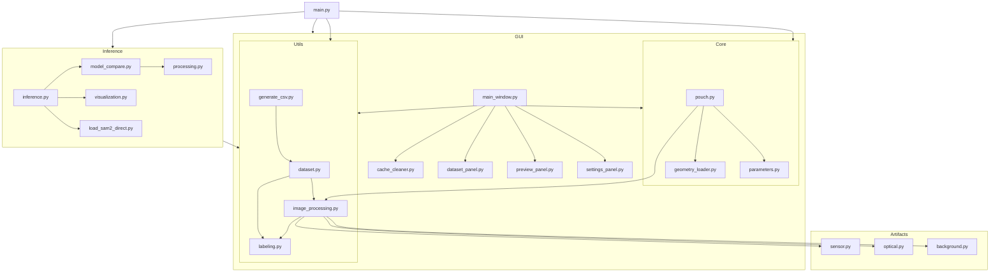

# Calcium Ion Dynamic Simulation System Architecture

This document describes the architecture and relationships between the different modules of the Calcium Ion Dynamic Simulation System.

## System Overview



## Module Descriptions

### Core

- **parameters.py**: Defines the `SimulationParameters` class that manages calcium simulation parameters for different simulation types.
- **pouch.py**: Central simulation class that implements the calcium signaling dynamics using PDEs. Handles cell geometry and simulation state.
- **geometry_loader.py**: Loads the cell geometry files needed for simulation (cell vertices, adjacency matrix, Laplacian matrix).

### Artifacts (Defect Simulation)

- **background.py**: Implements background defects such as background fluorescence, spontaneous luminescence, and cell fragments.
- **optical.py**: Implements optical defects such as chromatic aberration and vignetting.
- **sensor.py**: Implements sensor defects such as Poisson noise, readout noise, Gaussian noise, and dynamic range compression.

### Utils

- **dataset.py**: Manages dataset generation and statistics.
- **image_processing.py**: Processes images by applying various defects from the artifacts modules.
- **labeling.py**: Generates and manages labels for cell masks.
- **generate_csv.py**: Creates CSV mapping between images and their corresponding masks.

### GUI

- **main_window.py**: Main GUI window that integrates all panels and controls.
- **settings_panel.py**: Panel for configuring simulation parameters and defect settings.
- **preview_panel.py**: Displays simulation preview images.
- **dataset_panel.py**: Panel for managing dataset generation.
- **cache_cleaner.py**: Utility for cleaning cache files.

### Inference

- **inference.py**: Main inference module for running trained models on data.
- **model_compare.py**: Compares different model performance.
- **visualization.py**: Visualizes model outputs and results.
- **processing.py**: Processes data for model training and evaluation.
- **load_sam2_direct.py**: Loads SAM2 segmentation models.

## Data Flow

1. The system starts with the `Pouch` class, which performs the calcium dynamics simulation based on parameters.
2. Images are generated from the simulation state using `Pouch.generate_image()`.
3. Various defects are applied to the clean images using functions from the artifact modules.
4. The processed images are saved as datasets along with corresponding masks.
5. The generated datasets can be used for training and evaluating segmentation models in the inference module.
6. The GUI provides a user-friendly interface for configuring simulations and generating datasets.

## Key Functionalities

1. **Calcium Signaling Simulation**: Based on mathematical models of calcium dynamics in cells.
2. **Defect Simulation**: Various realistic imaging defects can be added.
3. **Dataset Generation**: Generate large batches of simulations with varied parameters.
4. **Cell Mask Generation**: Creates individual mask images for active cells.
5. **Model Training and Validation**: Fine-tuning SAM2 segmentation models on generated data.
```
